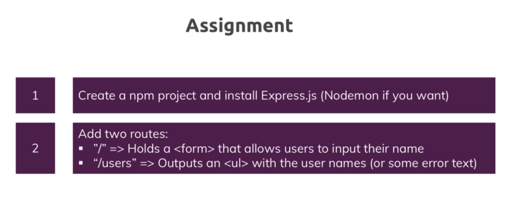

# Run Instructions

Navigate to either `pug` or `ejs` directory and use any of the following commands:

- **`npm start`** - run + watch
- **`npm build`** - build into `dist` directory.

To modify run/build scripts, look into `package.json` and `nodemon.json`.

## Assignment Question

