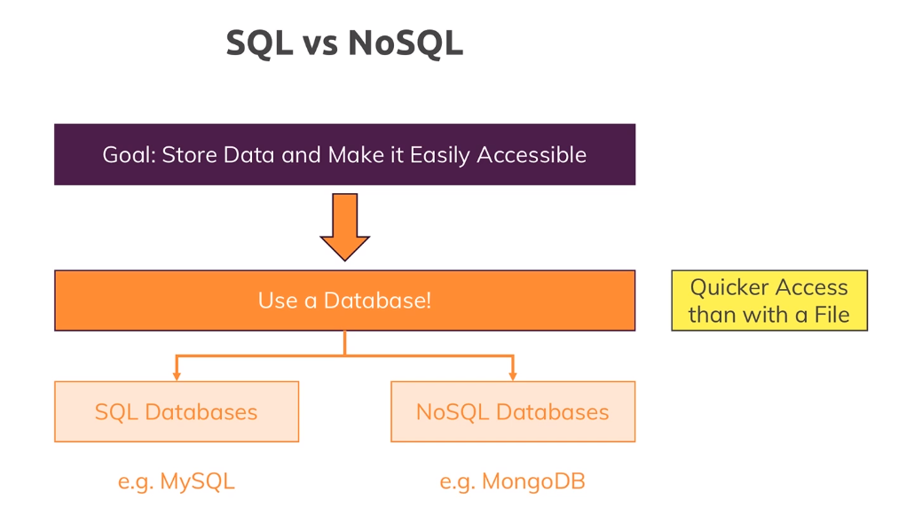

# Why Databases?

- The Goal of using a Database is that the data that we store is managed by the database, and the Database service provides the user with APIs that can make the life of a developer easier.
- Storing data in files is extremely tedious since files are slow and unorganized. And even if we want to make them organized, we might've to write a lot of code that is already available if we use Databases.
- Broadly, there are _two types_ of Databases:
  - __*Relational Databases*__: Uses relations/tables to store the data. To query such Databases, the universally accepted standard is Structured Query Language (SQL).
  - __*Non-Relational Databases*__: As such, there are many types of Non-Relational DBs like Graph DBs, Document DBs, etc, we'll focus only on Document DBs. Example of a Document only DB is MongoDB.

## SQL vs NoSQL

- Visit the following **[resource](https://academind.com/tutorials/sql-vs-nosql)** to know more about this.
