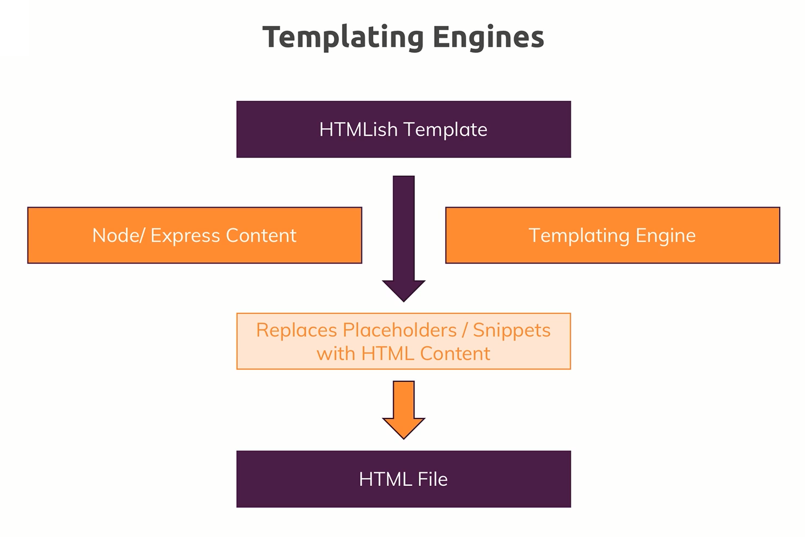
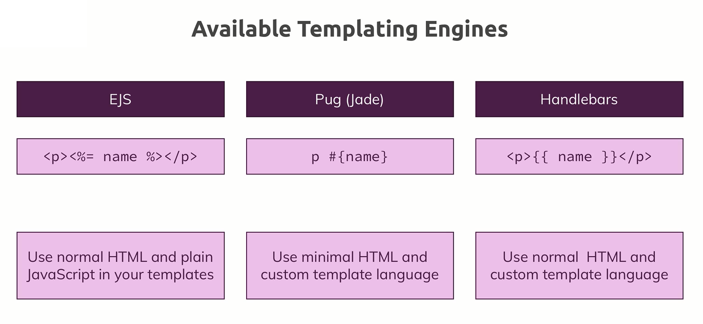

# Templating Engines

- Templating Engines allow us to dynamically render views.

## Available Templating Engines

- There are many available free templating engines, but there are three (3) extremely popular templating engines known as `EJS`, `Pug (Jade)` & `Handlebars`. The image below depicts the differences between the 3 templating engines mentioned before.

