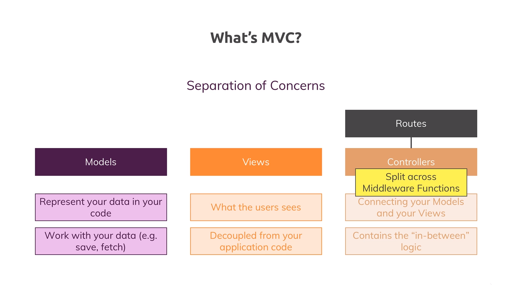

# MVC: Model View Controller Architecture

The image below depicts an overview of what MVC means.

- MVC is all about **`Separation of Concerns`** *i.e.*, making sure that different parts of our code, do different things and we [in the process] clearly know, which part is responsible for what.
- MVC stands for **Models - Views - Controllers**, where the ***Views*** part, we already know about it, since we've looked into the templating engine(s) and we've also known that the ***Views*** module is responsible what is shown to the users.
- ***Models*** are basically objects, \[OR\] is a part of our code that's responsible for **`Representing our data in our code`**. Models allow us to work with our data, examples include saving & fetching data to/from a file, using memory for temporary data storage, etc.
- ***Views*** are responsible for **`what the users see`** at the end. Also, rendering the right content onto the HTML documents and sending that back to the user, is one of the responsibilities which should be handled in here, and so, ***Views*** are always **`decoupled from the application's core logic`**, and just have some minor integrations regarding the data we inject into the templating engines, to generate these/the views.
- ***Controllers*** are always the connection points between the ***Models*** and the ***Views***. This is because, since the ***Views*** shouldn't care about the application logic, and the ***Models*** do only care about how to save/fetch the data, and so, the ***Controllers*** are the "thing" working with the ***Models*** saving/fetching that data (or at least triggering that save/fetch process) and so on..., and also, ***Controllers*** then pass that saved/fetched data to our ***Views***. Therefore, we can say that the Controller is the middle-man which **`contains the "in-between" logic`**.
- Logic related to **Routes** are handled in ***Controllers***. Routes are a construct which defines upon which path, for which HTTP method, which *controller* code should execute, and as we just understood, the *controller* is then the construct that defines with which *model* we're working with and also decides upon which *view* to render.
- This is the general concept of the MVC architecture/pattern. But, since we're working with Express, which heavily relies on the *Middleware Concept*, the ***Controllers*** are also kind of **`Split-Up across Middleware Functions`**, OR, some of the logic might be separated and moved into another middleware function, so to speak.
