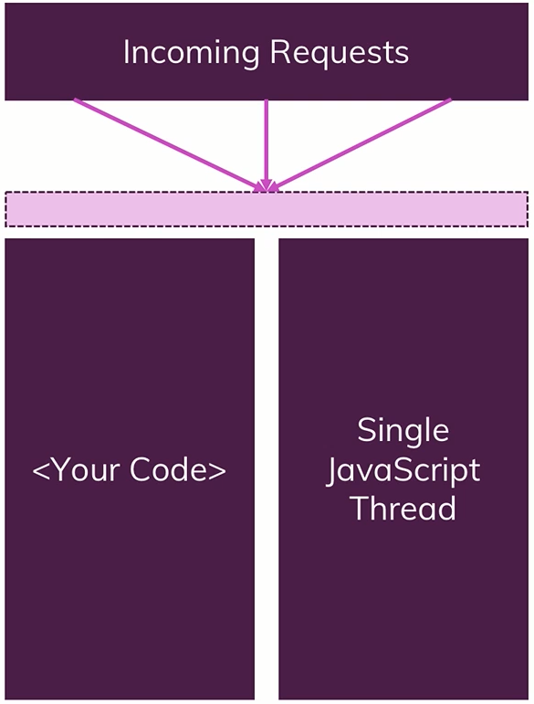
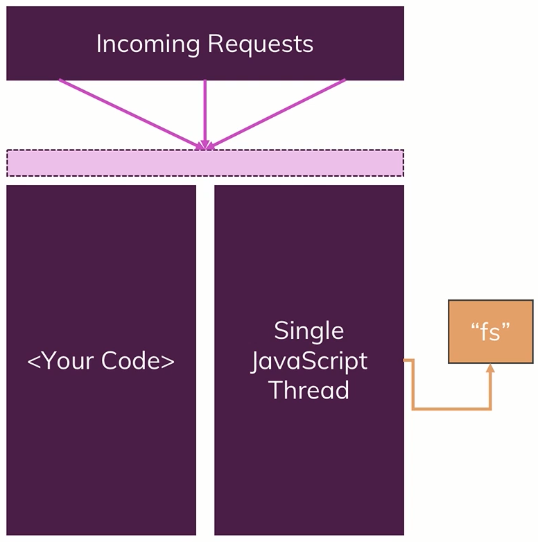
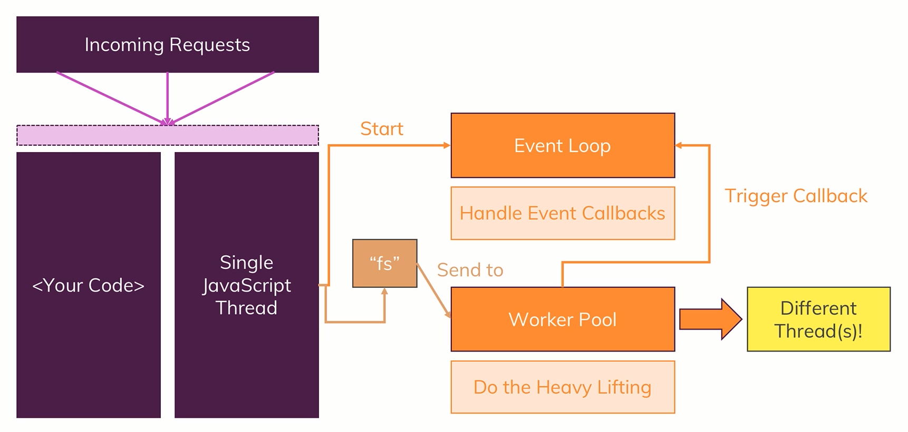
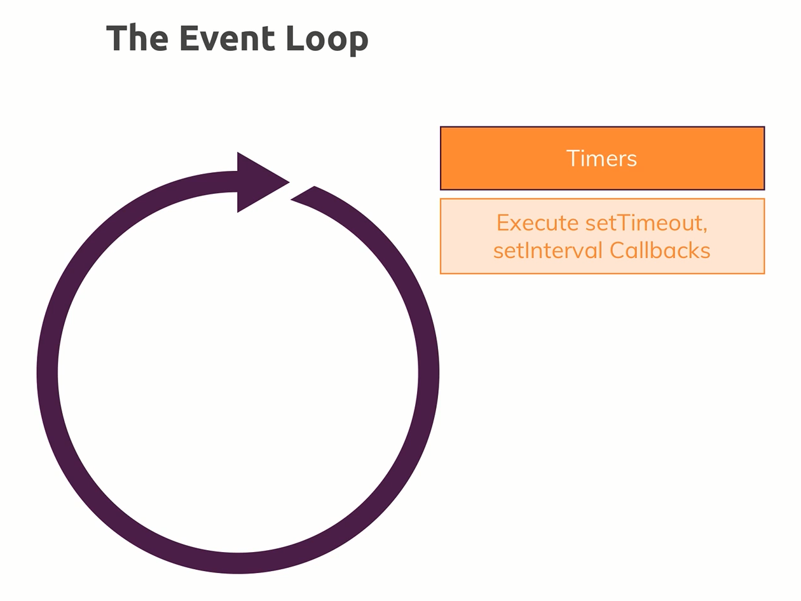
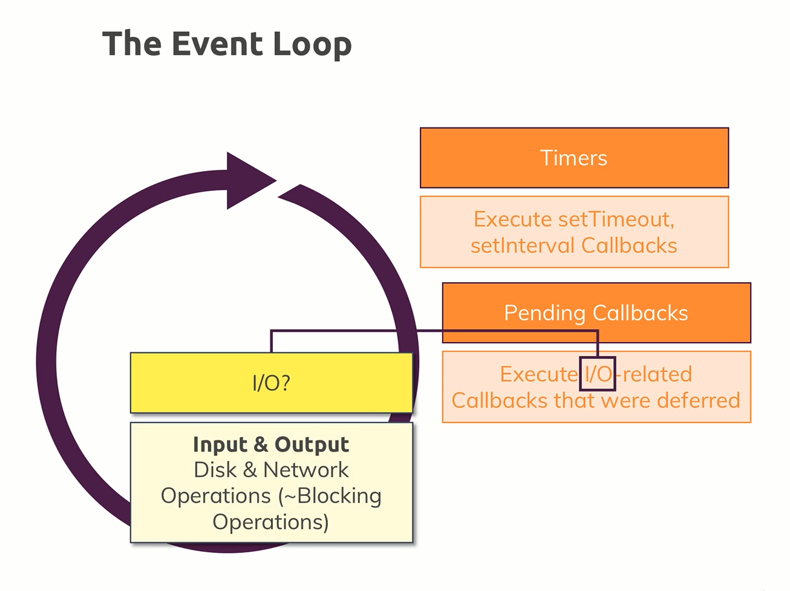
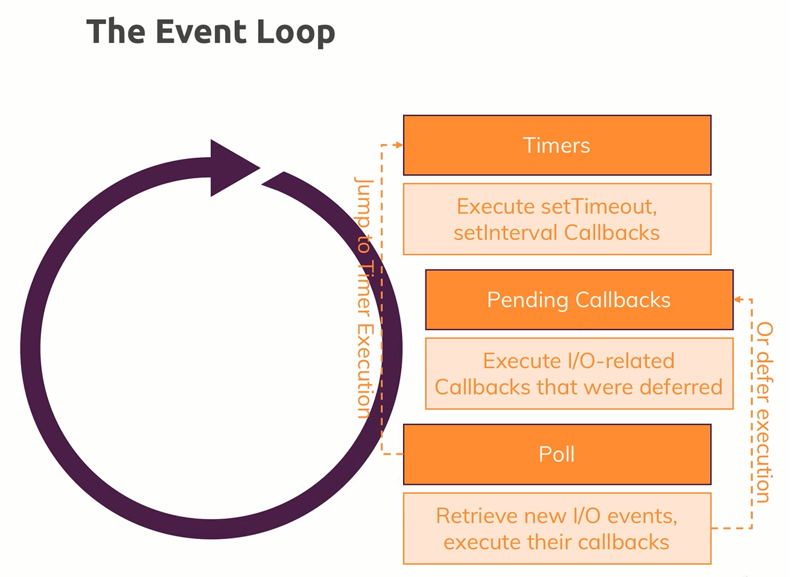
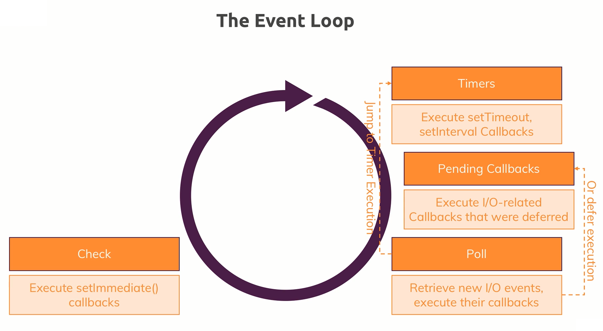
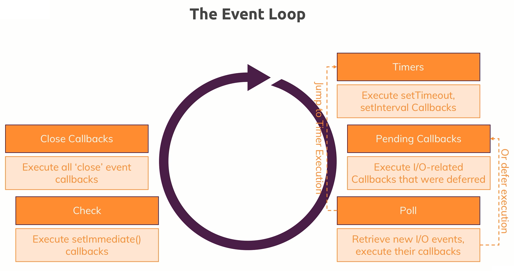
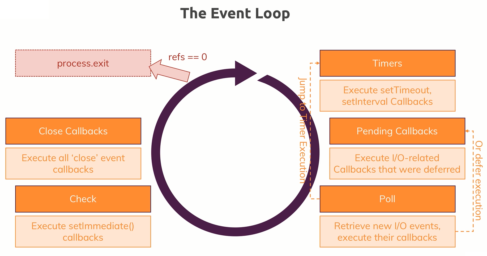

# Basics of Node JS

- The Node Lifecycle & Event Loop.
- Streams & Buffers.

## Node Lifecycle & Event Loop


- The code inside **[here](https://github.com/Ch-sriram/node-js-deno/blob/40982d85b9387018a88b9e8c1975eba1dd8429f2/understanding-basics/app.js)**, doesn't do everything we expect, *i.e.*, it doesn't return some kind of a response from the server, but it's generally showing us, how we create our own servers using NodeJS.
- When we typed in `node app.js` in the terminal and started the server, NodeJS **started the script**, **compiled** (*parsed code* & *registered variables* and *functions*) the code and started **executing the code**.
- But then something important happened, we never left that program, and the reason for that is because of an important concept in NodeJS called the **Event Loop**. Event Loop is a looping process which is managed by NodeJS, which keeps on running as long as there's work to do (*i.e.*, as long as there are event listeners registered). And the event listener we did register was there in the file **[here (line 93 in app.js)](https://github.com/Ch-sriram/node-js-deno/blob/40982d85b9387018a88b9e8c1975eba1dd8429f2/understanding-basics/app.js#L93)**, which we didn't un-register from (and we also shouldn't un-register, because servers are supposed to be up and running, always).
- **So our Core Node Application is basically managed by the Event Loop**. And so, NodeJS has an **Event Driven** architecture, and NodeJS uses this kind of architecture/pattern because NodeJS actually executes **Single-Threaded JavaScript**. So the entire Node process basically uses 1 Thread on the computer it's running on.
- So, if we create a server with NodeJS, we can ofcourse handle multiple thousands of incoming requests, and if we would always pause and do something with that request, it would not be that great, and hence, NodeJS uses this Event Loop concept where the server is always running and executes the respective code when a certain event occurs (and so in general, it's always available).
- And it might still sound like, "we've two or more incoming requests, how's the NodeJS server going to handle the requests which will have two events triggering?", but well, NodeJS is super-fast in handling these requests and actually, **behind the scenes NodeJS uses some Multi-Threading by leveraging the C++ language and the OS**.
- ***If we want to un-register the Event Loop***, we can do that using **`process.exit()`**, and the process running the NodeJS server will end. We can see this in action, **[here](https://github.com/Ch-sriram/node-js-deno/blob/5f8c03b229e23561949ba64772a85c334322ea6a/understanding-basics/app.js)**. Typically, we never call `process.exit()` because we never want to kill the server process, as it should always be up and running to serve the required resources to the front-end. And so, if we want to go for a *hard exit* (which is not recommended), we write `process.exit()`.

## Streams & Buffers

- The incoming data from a client is always sent as a *Stream* of data. ***Stream*** is a special construct JavaScript in general knows and in NodeJS it is used a lot.
- There's a connected concept to *Streams*, which are known as *Buffers*. A good example can be well depicted using the following image:  Our *Stream* here is simply an ongoing process where the `Incoming Request` is read by NodeJS in ***chunks*** (as we can see *Request Body Part 1*, *Part 2* and so on...) and in the end, at some point of time, the request is completely received by the server and it is *Fully Parsed*.
- And NodeJS request goes in a *Stream* as *chunks* because it is a deliberate ploy so that we can work on each chunk of data as we like without having to wait for the full request being read by the server (that's at least the theoretical aspect of it). For a simple request, this level of *handling every chunk of received data* is not required. But when we consider a file upload(s), then in that case, because it can take a long time to upload a/the file(s) &mdash; *Streaming that data* does make sense there because it would allow us at the server side, to writing the data we receive, to the disk/HDD/etc whilst the data is still incoming. So we don't need to parse the entire file (coming in chunks - which is ofcourse taking some time) and wait for it to complete the upload. And so, this is how NodeJS handles all requests because it doesn't know how complex and big they're.
- We can start working on the data early, but the problem at the server is that we cannot arbitrarily try to work with these chunks. Instead, to organize these incoming chunks we can use a construct known as *Buffer*. A ***Buffer*** is like a bus stop. If we consider busses, they're always being driven around the city. But for the commuters (users) to be able to work with them to commute on the bus, they need bus stops where the commuters can get in and get out of the bus and hence interact with the bus. That's what a **Buffer** is. Therefore, a Buffer is a construct which allows the server to hold multiple chunks (from the stream of data being received) and work with them before they're released once we are done. And so, at the server-side, we generally work with the ***Buffer*** to handle the `Incoming Request` as seen below: 
- Please look into this **[commit](https://github.com/Ch-sriram/node-js-deno/commit/ca12eb612d904d107763ec504e03f74064fcb035#diff-b968952e95c13745e3373dadd0b3751ad0c9ff930bc1d81275a09709c5d02471)** to see how it works in practice.

## Event Driven Code Execution

NOTE: Following section is a must read to understand how we write code that can potentially cause errors.

- For a lot of people, it is a mystery how NodeJS as a server, executes the code. Because sometimes, the code that occurs before the code that appears after, may execute later compared to the code that appeared after. Simply put, [this LOC (L109)](https://github.com/Ch-sriram/node-js-deno/blob/eeefc58bec061fd67261ee1406b0d0b320cbd507/understanding-basics/src/index.ts#L109) can execute after [this LOC (L115)](https://github.com/Ch-sriram/node-js-deno/blob/eeefc58bec061fd67261ee1406b0d0b320cbd507/understanding-basics/src/index.ts#L115) [and it will actually execute in that order]. So code at L109 will execute after code in L115 *i.e.*, after we've already sent the response.
- This has 2 important implications:
  - Sending a response does NOT mean that our event listener(s) like in [this LOC](https://github.com/Ch-sriram/node-js-deno/blob/eeefc58bec061fd67261ee1406b0d0b320cbd507/understanding-basics/src/index.ts#L95) (*i.e.*, the callback function) are dead. They'll still execute even if the response is already gone. But it also means that if we do something in the event listener(s) like `request.on('end')` or `request.on('data')` (or any other event listener) that influences the response, the [code from L115 to L122](https://github.com/Ch-sriram/node-js-deno/blob/eeefc58bec061fd67261ee1406b0d0b320cbd507/understanding-basics/src/index.ts#L115-L122) is the wrong way to set it up. We should then also move the code that is related to response, into the event listener, as seen [here in this commit from L111 to L118](https://github.com/Ch-sriram/node-js-deno/blob/b6328e61a459f7ea61e1d3ceef0582025063d672/understanding-basics/src/index.ts#L111-L118).
  - And it also means that it's extremely important to understand, that with event listeners like `request.on(<some-event>)` or code like:

  ```typescript
    http.createServer((req: IncomingMessage, res: ServerResponse) => { /** some return value */ });
  ```

  these are some examples where NodeJS uses a pattern where we pass a function to a function and NodeJS will execute these passed-in functions at a later point of time (since they're passed in as callback functions) which is/are called asynchronously.

  - It is not always the case that a passed-in function to another function is necessarily executed at a later point of time, but NodeJS uses this kind of pattern heavily and so, a lot of backend code that uses NodeJS looks like this and so, it executes the code asynchronously.
  - In such cases, NodeJS won't immediately run the passed-in callback function. Instead what it does is that it will add a new event listener internally (NodeJS manages all the listeners internally) whenever it sees a callback function. In case of the `request.on('end')` event, on the request, which will be triggered automatically once NodeJS is done parsing the request, and then call that callback function for us once parsing is done.
  - Therefore, we can think of it as NodeJS having an internal registry of events and listeners to these events, and a callback passed to an event (`request.on()` & `http.createServer()`), is the listener. And so, when NodeJS is done parsing the request, it will go through the internal registry it maintains and see that once it done with the request, it will call the listeners that are related to the `end` event. Hence it will find all the listeners (callback functions) registered for the `end` event and call them asynchronously, due to that it will not pause the execution of any other code.
  - **Example**: And so, we can see in [this file here](https://github.com/Ch-sriram/node-js-deno/blob/b6328e61a459f7ea61e1d3ceef0582025063d672/understanding-basics/src/index.ts) that NodeJS will start parsing from L1 to L8. At L8, NodeJS will register the callback/event-listener sent to `http.createServer((req, res) => {...})` and then it will jump to L146 where NodeJS starts listening to incoming request(s).
  - As soon as NodeJS gets a request, it will call the registered callback/event-listener it registered when `createServer()` was called earlier and it starts executing L9 to L82 depending on what the request contains. At L83 & L94, NodeJS will register two events as seen in the code (along with their listeners/callbacks) and then it will start executing from L121 to L141. At L141, NodeJS sees that `response.end()` is called and so NodeJS will call the listener/callback related to the `end` event (which is code from L95 to L119). And in-between all this, if there's any request that is related to `data` event, the callback related to that will be called (which is code from L84 to L87).
  - Because of the way NodeJS executes code, we've to be extremely careful of how we write code and on what events, what kind of listeners are to be called. This output of the code mentioned in the commit above is [here](https://github.com/Ch-sriram/node-js-deno/blob/5f4d6c46a4137e31004e8489575a123c032fd26a/understanding-basics/src/index.ts#L148-L161) which will give errors.

### Event Driven Code Execution: Writing Events That Won't Error Out

- We get an error for the way we coded above because NodeJS already set the headers in [L123 here](https://github.com/Ch-sriram/node-js-deno/blob/5f4d6c46a4137e31004e8489575a123c032fd26a/understanding-basics/src/index.ts#L123). And so, the headers that are set after the occurring of the `end` event, would error out. One of them is in [L111 here](https://github.com/Ch-sriram/node-js-deno/blob/5f4d6c46a4137e31004e8489575a123c032fd26a/understanding-basics/src/index.ts#L111).
- But this kind of setup is important, because otherwise, NodeJS would've to block the code below some callback and wait for the callback to be executed, which is NOT feasible, as servers need to handle multiple incoming requests at a time. Therefore, we NEVER want to BLOCK the execution of code. We always want to wait for the event to occur in the event loop and then once the event occurs, we should execute the event listener (or callback related to the event) [NOTE: 'we' here refers to NodeJS]. And so that way, the code execution is never blocked aka NON-BLOCKING Code Execution.
- For the code to not error out, we basically return the event at [L94 here](https://github.com/Ch-sriram/node-js-deno/commit/86f0571879f47a6202d50251dca3d3374c83dabb#diff-9f8c87a053f47465defc2ede5990a09b615313f888333b1211bb762b7ac0122fR94).

## Single Thread, Event Loop & Blocking Code - In-Depth

- We know how Node works with asynchronous code and we know the functioning of the event loop. In this section, we'll dive deeper into how NodeJS exactly executes the backend code to stay performant, and still be able to handle long/arduous tasks (like working with files).
- In our Node application, we've our code and one important thing to keep always in mind is that, NodeJS uses only **One JavaScript Thread**, thereby making it a Single Threaded Runtime. 
- Then, the question is this: ***How is a Single Threaded Runtime like NodeJS, able to handle multiple Incoming Requests?***. Why is this question so important? That's because if we're not able to assign a new thread for each request, all of the requests will ultimately end up running on the same thread. And so, this ofcourse poses some security concerns, one of which can be: *Can request A access request B's data (or vice-versa)?* And, most importantly, when we talk about the performance (since NodeJS is a Single Threaded Runtime), there are, again, many concerns, out of which, one of them is: *When request A is still doing work (accessing CPU time), does that mean that request B can't be handled?* (a simple answer to that is, both request A and request B are taken care by NodeJS at the same time).
- On the question of **Performance in a Single Threaded JavaScript Runtime like NodeJS**:
  - Let's say we have some code that accesses the file system using the `fs` module. Now we know that, working with files often is a task that arduous and can take a long time to finish depending on the contents and the size of the file. Therefore, if we are doing file operations on a particular request, and if there's another request incoming, the incoming request might've to wait in the queue, because NodeJS might not be able to handle it yet, or worse, it can totally decline the incoming request (basically our web server is down/not-responding for that particular incoming request). 
  - One important construct we already are familiar with is the **Event Loop** &mdash; which is automatically started by NodeJS when the backend code starts to run. We don't need to handle the event loop explicitly. The *Event Loop* is basically responsible for **Handling Event Callbacks** (eg: `const server = http.createServer((request: IncomingMessage, response: ServerResponse) => {/* handle server request/response */})`, where `(request: IncomingMessage, response: ServerResponse) => {/* handle server request/response */}` is the *Event Callback*) *i.e.,* the event loop is responsible for basically running the callback's code when a certain event occurs. But that doesn't help us with our time-taking and costly file operation though. And it is extremely important to understand that the ***file operation is NOT handled by the Event Loop, just the CALLBACK (that we might've to find) on write/read event of the file, once the file operation is executed successfully, that particular code (which is the CALLBACK) will be handled in the Event Loop &mdash; but that code will execute extremely, quickly***. Instead, file system operation(s) (and a couple of other costly operations) are sent to a **Worker Pool**, which is also spun up and managed by NodeJS automatically. This *Worker Pool* is responsible for all the heavy-lifting. **The _Worker Pool_ is kind of totally detached from our JavaScript code and runs on Different Threads** *i.e.,* the *Worker Pool* can **spin up multiple threads**, it's closely intervened with the OS on which we're running the app on.
  - So the **Worker Pool** is really detached from the Backend JavaScript code, And this *Worker Pool* is therefore doing all the heavy-lifting *i.e.*, if we're doing something with a file, a *worker* from the *worker pool* take care of the file operations and will do its job totally detached from the JavaScript code written in the server, from the request, and from the event loop.
  - One connection, the *Worker Pool* will have is that, once the *worker* has completed the job assigned to it (*i.e.*, once the file has been read/written), it will **Trigger the Callback** for that particular job, and since the *Event Loop* is responsible for the *Events* and the *Callbacks*, this will in the end, end up in the *Event Loop*. So in the *Event Loop*, NodeJS will then basically execute the appropriate *Callback*. 
- Onto the **Event Loop**:
  - The *Event Loop* is a loop which is run/started by NodeJS that keeps the NodeJS process running and as we mentioned above, it handles all the *Callbacks* & it has a certain order in which it goes through the *Callbacks*.
  - **Timer Callback Execution Phase**: The *Event Loop* keeps on looping and at the beginning of each new iteration, it checks if there are any **Timer Callbacks** to execute which in code are *Callbacks* related to `setTimeout()` and `setInterval()`. These two methods are also available when writing code for frontend using JavaScript. Now, in NodeJS, we can also set a timer using `setTimeout()` or `setInterval()` and pass a method/callback, that should be executed once that timer completes. And so, NodeJS is aware of this and at the beginning of each new iteration of the *Event Loop*, it executes any due timer callback *i.e.*, any *Callback* that has to be executed because of exhaustion of the timer. 
  - **Pending Callback Execution Phase**: As the next step, the *Event Loop* checks other **Pending Callbacks**, for example, if we already were executing an I/O task such as writing/reading a file, and then that operation finished before the new iteration of the *Event Loop*, then that particular finished I/O task might've a *Callback* because that operation finished and then *Event Loop* will then also execute those *Callbacks*. Be aware that **I/O** means **any Input or Output operation that can be file operations, network operations, or in general, *BLOCKING* (costly - time taking) operations**. *Now it's important to understand that NodeJS will leave that phase at a certain point of time*. That can also mean that *if there are too many outstanding callbacks*, the *Event Loop* will *continue its loop's iteration*, and *postpone the remaining outstanding callbacks to the next iteration of the Event Loop* ot execute them. 
  - **Polling Phase**: After working on the *Callbacks* mentioned above, *Event Loop* will enter **Poll Phase** where NodeJS looks for new I/O events and execute their *Callbacks* immediately if possible. Now, if it is not possible for NodeJS to execute those *Callbacks* immediately, it'll defer the execution and register the *Callbacks* as ***Pending Callbacks***. Also, in the **Poll Phase**, NodeJS will check if there are any **Timer Callbacks** due to be executed, and if that's the case, then it'll jump to that **Timer Callback Execution Phase** and execute the respective *Callbacks* right away, and so, NodeJS can actually jump to the previous phase in the *Event Loop* and NOT finish the iteration in a sequence. 
  - **Check Phase**: During the same iteration, if the NodeJS successfully goes through the aforementioned phases, `setImmediate()` function's *Callbacks* will be executed. The `setImmediate()` function is a bit like `setTimeout()` or `setInterval()`, just that it'll execute immediately, but always, after any *outstanding callbacks* have been executed. It is like this: `setTimeout()` will be faster than `setImmediate()` if `setTimeout()` is passed with *0ms* timeout duration. Because then, in the next iteration of the *Event Loop*, first, any *outstanding timer callbacks* will be executed, in which, the `setTimeout()`'s callback will be executed, as it's timer got exhausted (since *0ms* is the given time), and then in the `Check Phase`, the `setImmediate()` will be executed. For more information, please look into &mdash; **[setTimeout vs. setImmediate](https://dev.to/logicmason/settimeout-vs-setimmediate-vs-process-nexttick-3lj2)**. 
  - **Close Phase**: When nearing the end of iteration in the *Event Loop*, NodeJS executes all the *Event Callbacks* related to **Close Events**. If there are any `close` events registered in the code, this would be the phase where NodeJS executes the respective callbacks for the `close` events. 
  - __Exit Phase &mdash; **Optional**__: After all the `close` event callbacks are executed, _we might exit the whole NodeJS program, but iff there are NO remaining Event Handlers in the code which are registered with NodeJS' Event Manager, and that's shown below with `refs == 0` below_. Internally, NodeJS keeps track of its open event listeners, and it basically has a counter known as **References** known as `refs` (in the code) which NodeJS increments by 1 for every new *Event Listener/Callback* that's registered, and it reduces `refs` by 1 for every *Event Listener/Callback* it doesn't need to execute anymore. And, since in a *server environment*, we create a server using `http.createServer()` and then listen to the *incoming requests* using the `listen()` function, which makes it an event which is never fully executed by default, and so, we'll always, at least have `refs = 1` (*i.e.*, there will be at least 1 Reference to an *Event's Callback*, which is the callback to the `createServer()` function) and **therefore, we don't/never execute in a normal Node WebServer Program**. We can manually call the `process.exit()` function to voluntarily exit the NodeJS instance.
  - And so, the following is the **Big Picture for Event Loops**: 
