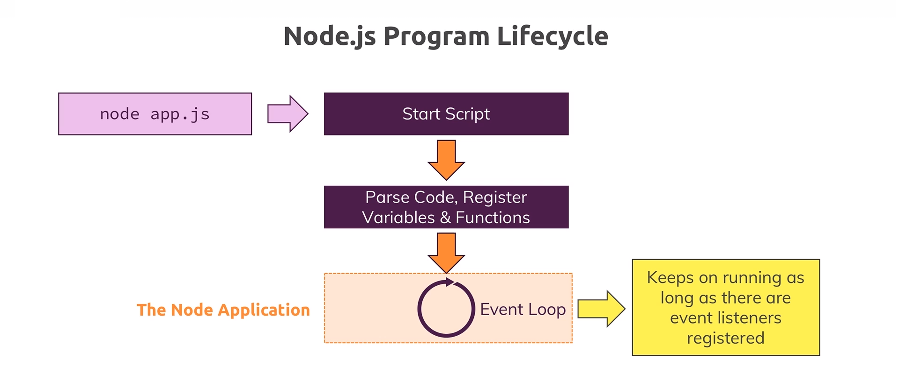
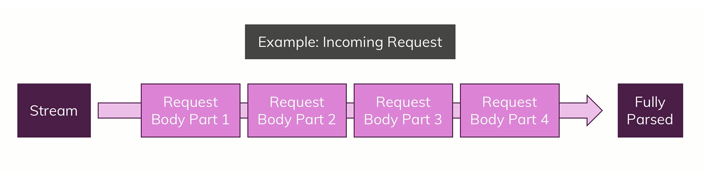
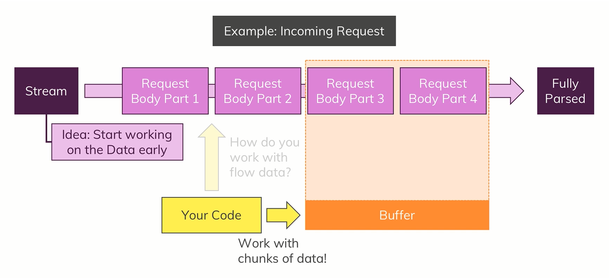

# Basics of Node JS

- The Node Lifecycle & Event Loop.
- Streams & Buffers.

## Node Lifecycle & Event Loop



- The code inside **[here](https://github.com/Ch-sriram/node-js-deno/blob/40982d85b9387018a88b9e8c1975eba1dd8429f2/understanding-basics/app.js)**, doesn't do everything we expect, *i.e.*, it doesn't return some kind of a response from the server, but it's generally showing us, how we create our own servers using NodeJS.
- When we typed in `node app.js` in the terminal and started the server, NodeJS **started the script**, **compiled** (*parsed code* & *registered variables* and *functions*) the code and started **executing the code**.
- But then something important happened, we never left that program, and the reason for that is because of an important concept in NodeJS called the **Event Loop**. Event Loop is a looping process which is managed by NodeJS, which keeps on running as long as there's work to do (*i.e.*, as long as there are event listeners registered). And the event listener we did register was there in the file **[here (line 93 in app.js)](https://github.com/Ch-sriram/node-js-deno/blob/40982d85b9387018a88b9e8c1975eba1dd8429f2/understanding-basics/app.js#L93)**, which we didn't un-register from (and we also shouldn't un-register, because servers are supposed to be up and running, always).
- **So our Core Node Application is basically managed by the Event Loop**. And so, NodeJS has an **Event Driven** architecture, and NodeJS uses this kind of architecture/pattern because NodeJS actually executes **Single-Threaded JavaScript**. So the entire Node process basically uses 1 Thread on the computer it's running on.
- So, if we create a server with NodeJS, we can ofcourse handle multiple thousands of incoming requests, and if we would always pause and do something with that request, it would not be that great, and hence, NodeJS uses this Event Loop concept where the server is always running and executes the respective code when a certain event occurs (and so in general, it's always available).
- And it might still sound like, "we've two or more incoming requests, how's the NodeJS server going to handle the requests which will have two events triggering?", but well, NodeJS is super-fast in handling these requests and actually, **behind the scenes NodeJS uses some Multi-Threading by leveraging the C++ language and the OS**.
- ***If we want to un-register the Event Loop***, we can do that using **`process.exit()`**, and the process running the NodeJS server will end. We can see this in action, **[here](https://github.com/Ch-sriram/node-js-deno/blob/5f8c03b229e23561949ba64772a85c334322ea6a/understanding-basics/app.js)**. Typically, we never call `process.exit()` because we never want to kill the server process, as it should always be up and running to serve the required resources to the front-end. And so, if we want to go for a *hard exit* (which is not recommended), we write `process.exit()`.

## Streams & Buffers

- The incoming data from a client is always sent as a *Stream* of data. ***Stream*** is a special construct JavaScript in general knows and in NodeJS it is used a lot.
- There's a connected concept to *Streams*, which are known as *Buffers*. A good example can be well depicted using the following image:  Our *Stream* here is simply an ongoing process where the `Incoming Request` is read by NodeJS in ***chunks*** (as we can see *Request Body Part 1*, *Part 2* and so on...) and in the end, at some point of time, the request is completely received by the server and it is *Fully Parsed*.
- And NodeJS request goes in a *Stream* as *chunks* because it is a deliberate ploy so that we can work on each chunk of data as we like without having to wait for the full request being read by the server (that's at least the theoretical aspect of it). For a simple request, this level of *handling every chunk of received data* is not required. But when we consider a file upload(s), then in that case, because it can take a long time to upload a/the file(s) &mdash; *Streaming that data* does make sense there because it would allow us at the server side, to writing the data we receive, to the disk/HDD/etc whilst the data is still incoming. So we don't need to parse the entire file (coming in chunks - which is ofcourse taking some time) and wait for it to complete the upload. And so, this is how NodeJS handles all requests because it doesn't know how complex and big they're.
- We can start working on the data early, but the problem at the server is that we cannot arbitrarily try to work with these chunks. Instead, to organize these incoming chunks we can use a construct known as *Buffer*. A ***Buffer*** is like a bus stop. If we consider busses, they're always being driven around the city. But for the commuters (users) to be able to work with them to commute on the bus, they need bus stops where the commuters can get in and get out of the bus and hence interact with the bus. That's what a **Buffer** is. Therefore, a Buffer is a construct which allows the server to hold multiple chunks (from the stream of data being received) and work with them before they're released once we are done. And so, at the server-side, we generally work with the ***Buffer*** to handle the `Incoming Request` as seen below: 
- Please look into this **[commit](https://github.com/Ch-sriram/node-js-deno/commit/ca12eb612d904d107763ec504e03f74064fcb035#diff-b968952e95c13745e3373dadd0b3751ad0c9ff930bc1d81275a09709c5d02471)** to see how it works in practice.

## Event Driven Code Execution

NOTE: Following section is a must read to understand how we write code that can potentially cause errors.

- For a lot of people, it is a mystery how NodeJS as a server, executes the code. Because sometimes, the code that occurs before the code that appears after, may execute later compared to the code that appeared after. Simply put, [this LOC (L109)](https://github.com/Ch-sriram/node-js-deno/blob/eeefc58bec061fd67261ee1406b0d0b320cbd507/understanding-basics/src/index.ts#L109) can execute after [this LOC (L115)](https://github.com/Ch-sriram/node-js-deno/blob/eeefc58bec061fd67261ee1406b0d0b320cbd507/understanding-basics/src/index.ts#L115) [and it will actually execute in that order]. So code at L109 will execute after code in L115 *i.e.*, after we've already sent the response.
- This has 2 important implications:
  - Sending a response does NOT mean that our event listener(s) like in [this LOC](https://github.com/Ch-sriram/node-js-deno/blob/eeefc58bec061fd67261ee1406b0d0b320cbd507/understanding-basics/src/index.ts#L95) (*i.e.*, the callback function) are dead. They'll still execute even if the response is already gone. But it also means that if we do something in the event listener(s) like `request.on('end')` or `request.on('data')` (or any other event listener) that influences the response, the [code from L115 to L122](https://github.com/Ch-sriram/node-js-deno/blob/eeefc58bec061fd67261ee1406b0d0b320cbd507/understanding-basics/src/index.ts#L115-L122) is the wrong way to set it up. We should then also move the code that is related to response, into the event listener, as seen [here in this commit]().
  - And it also means that it's extremely important to understand, that with event listeners like `request.on(<some-event>)` or code like: 
  ```ts
    http.createServer((req: IncomingMessage, res: ServerResponse) => { /** some return value */ });
  ```
  these are some examples where NodeJS uses a pattern where we pass a function to a function and NodeJS will execute these passed-in functions at a later point of time (since they're passed in as callback functions) which is/are called asynchronously.

  It is not always the case that a passed-in function to another function is necessarily executed at a later point of time, but NodeJS uses this kind of pattern heavily and so, a lot of backend code that uses NodeJS looks like this and so, it executes the code asynchronously.

  In such cases, NodeJS won't immediately run the passed-in callback function. Instead what it does is that it will add a new event listener internally (NodeJS manages all the listeners internally) whenever it sees a callback function. In case of the `request.on('end')` event, on the request, which will be triggered automatically once NodeJS is done parsing the request, and then call that callback function for us once parsing is done.

  Therefore, we can think of it as NodeJS having an internal registry of events and listeners to these events, and a callback passed to an event (`request.on()` & `http.createServer()`), is the listener. And so, when NodeJS is done parsing the request, it will go through the internal registry it maintains and see that once it done with the request, it will call the listeners that are related to the `end` event. Hence it will find all the listeners (callback functions) registered for the `end` event and call them asynchronously, due to that it will not pause the execution of any other code.

  **Example**
  And so, we can see in [this commit here]() that NodeJS will start parsing from L1 to L8. At L8, NodeJS will register the callback/event-listener sent to `http.createServer((req, res) => {...})` and then it will jump to L146 where NodeJS starts listening to incoming request(s).

  As soon as NodeJS gets a request, it will call the registered callback/event-listener it registered when `createServer()` was called earlier and it starts executing L9 to L82 depending on what the request contains. At L83 & L94, NodeJS will register two events as seen in the code (along with their listeners/callbacks) and then it will start executing from L121 to L141. At L141, NodeJS sees that `response.end()` is called and so NodeJS will call the listener/callback related to the `end` event (which is code from L95 to L119). And in-between all this, if there's any request that is related to `data` event, the callback related to that will be called (which is code from L84 to L87).

  Because of the way NodeJS executes code, we've to be extremely careful of how we write code and on what events, what kind of listeners are to be called. This output of the code mentioned in the commit above is [here]() which will give errors.

### Event Driven Code Execution: Writing Events That Won't Error Out


