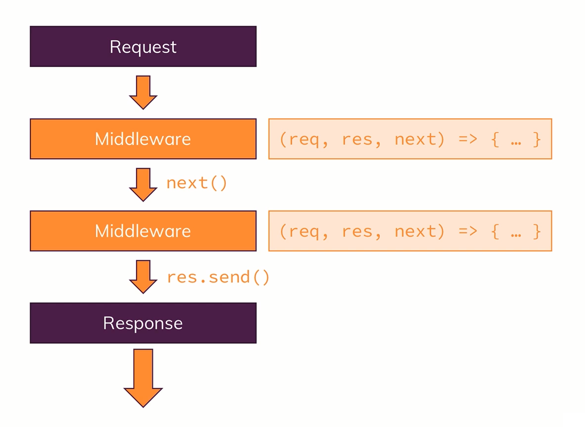

# Express as a Middleware

- Middleware means that the `IncomingRequest` is funnelled through functions/methods provided by ExpressJS. So, instead of just having one request handler, we'll actually have a possibility of hooking in multiple functions, which the request will go through, until we send a response.
- This allows us to split our code into multiple blocks/pieces of code (instead of having one huge function that does everything) and this is the plug-able nature of ExpressJS where we can easily add other 3rd party packages which simply happen to give us such middleware functions that we can plug into ExpressJS and add certain functionalities.

## Express.js: Behind the Scenes

On GitHub, express.js is open-sourced, and so, we can see the code related to express.js, specifically, we can see some interesting sections like:

- **[send()](https://github.com/expressjs/express/blob/508936853a6e311099c9985d4c11a4b1b8f6af07/lib/response.js#L107)**: In [L141 of response.js](https://github.com/expressjs/express/blob/508936853a6e311099c9985d4c11a4b1b8f6af07/lib/response.js#L141), `send()` analyzes the kind of data a response body is trying to send, and it is evident that if the data sent is a `string` type data, the `Content-Type` is set to `text/html` as seen from [L143 to L147](https://github.com/expressjs/express/blob/508936853a6e311099c9985d4c11a4b1b8f6af07/lib/response.js#L143-L147) and for types `number`, `boolean` or `object`, the `Content-Type` is set to `text/binary` which can be seen from [L148 to L160](https://github.com/expressjs/express/blob/508936853a6e311099c9985d4c11a4b1b8f6af07/lib/response.js#L148-L160).
- **[app.listen()](https://github.com/expressjs/express/blob/508936853a6e311099c9985d4c11a4b1b8f6af07/lib/application.js#L616-L619)**: Now, instead of using the `http` module to create a server with `http.createServer(app).listen(<port_number>)`, we can simply use `app.listen(<port_number>)`, because if we look into the code related to `app.listen()` from [L617 to L618](https://github.com/expressjs/express/blob/508936853a6e311099c9985d4c11a4b1b8f6af07/lib/application.js#L617-L618), we can see that it uses `http.createServer()` to make a server. Therefore, it is kind of same, using `app.listen()` or `http.createServer().listen()`. Therefore, we can replace **[this line](https://github.com/Ch-sriram/node-js-deno/commit/c605244443c83725e89f428e7c5f6fec837a292a#diff-9aa0b207299d6279a2b3a26798d30839bed45259b3587950a36e4e40aa903c3aR13)** with `app.listen(<port_number>)`.
**NOTE**: `app` is actually defined as `const app = express()` as seen **[here](https://github.com/Ch-sriram/node-js-deno/commit/c605244443c83725e89f428e7c5f6fec837a292a#diff-9aa0b207299d6279a2b3a26798d30839bed45259b3587950a36e4e40aa903c3aR10)**.
